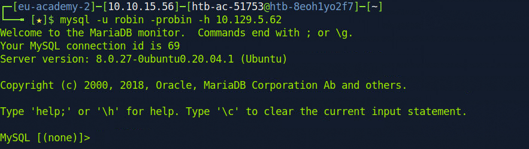

# Module Summary

This module covers all aspects of a penetration test from start to finish. We work through a simulated External Penetration Test resulting in internal network access and ultimate compromise of the Active Directory environment. This module seeks to tie together all topics taught in the Penetration Tester path and can be thought of as a capstone module for that path, but can also be done standalone.

<figure><figcaption></figcaption></figure>

In this module, we will cover:

* Reviewing a letter of engagement and going over rules of engagement and scope
* External information gathering
* External web and service enumeration and exploitation
* Gaining a foothold internally
* Post-exploitation and gaining persistence inside the network
* Internal information gathering and lateral movement
* Active Directory enumeration and compromise
* Post-exploitation
* Structuring findings and communicating with our client
